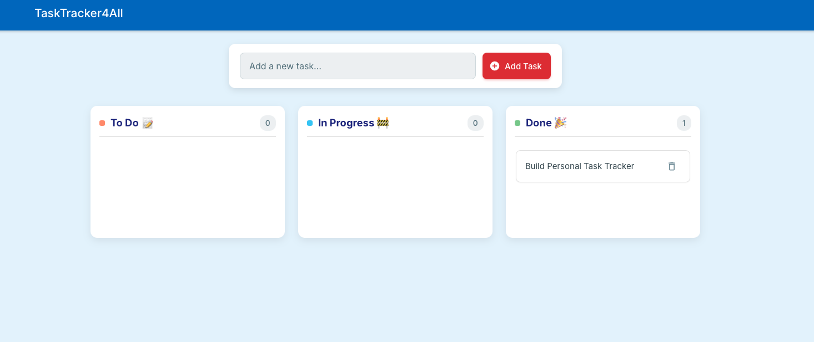

# Kanban Task Tracker

A real-time, interactive Kanban board application to help you manage your tasks efficiently. Built with Vanilla JavaScript, HTML, and CSS, this app uses Firebase Firestore for backend data storage and persistence, and Firebase Hosting for deployment. It features a clean, user-friendly interface with drag-and-drop functionality and a celebratory confetti animation upon task completion.

**Live Demo:** [https://tasktracker4all.web.app](https://tasktracker4all.web.app)



## Overview

This application provides a visual way to track tasks through different stages of completion: "To Do", "In Progress", and "Done". Tasks are stored in real-time in a Firebase Firestore database, meaning changes are reflected instantly across any open instances of the app. The user interface is designed to be clean and intuitive, drawing inspiration from modern task management tools.

## Features

* **Task Creation:** Easily add new tasks to your board.
* **Drag-and-Drop Kanban Board:** Visually move tasks between "To Do", "In Progress", and "Done" columns.
* **Real-time Data Sync:** Uses Firebase Firestore to ensure tasks are updated live and persisted across sessions and devices.
* **Confetti Animation:** A fun confetti burst celebrates when a task is moved to the "Done" column.
* **Persistent Storage:** Tasks are saved in Firebase, so you won't lose them when you close your browser.
* **Task Deletion:** Remove tasks you no longer need.
* **Task Counts:** Each column header displays the current number of tasks within it.
* **Emojis:** Use emojis in your task descriptions and in column titles for better visual organization.

## Tech Stack

* **Frontend:**
    * HTML5
    * CSS3 (Clean, modern design with a custom stylesheet)
    * Vanilla JavaScript (for all client-side logic and DOM manipulation)
* **Backend & Database:**
    * Firebase Firestore (NoSQL cloud database for real-time data storage)
* **Deployment & Hosting:**
    * Firebase Hosting (for serving the static web application)
    * GitHub Actions (for Continuous Integration/Continuous Deployment - CI/CD)
* **Libraries:**
    * `canvas-confetti` (for the task completion animation)
* **Development Tools:**
    * Node.js & npm (for managing `package.json` and running scripts in CI/CD)
    * Firebase CLI (for local testing and interaction with Firebase services)
    * Git & GitHub (for version control and CI/CD trigger)

## How to Use the Web App

Using the Kanban Task Tracker is straightforward:

1.  **View Your Board:** When you open the app, you'll see three columns: "To Do," "In Progress," and "Done." Any existing tasks will be loaded from Firebase.
2.  **Add a New Task:**
    * Locate the input field (usually at the top or center of the page) labeled "Add a new task...".
    * Type the description of your task. You can include emojis!
    * Click the "Add Task" button. Your new task will appear in the "To Do" column.
3.  **Move Tasks:**
    * To change the status of a task, simply click and drag it from its current column to another column (e.g., from "To Do" to "In Progress").
4.  **Complete Tasks:**
    * When a task is finished, drag it to the "Done" column.
    * Enjoy a celebratory confetti animation!
5.  **Delete Tasks:**
    * Each task card has a delete icon (often an 'X' or a trash can icon).
    * Click this icon to permanently remove the task from your board and the database.
6.  **Real-Time Updates:** If you have the app open in multiple browser tabs or on different devices (and they are connected to the same Firebase project), changes made in one place will reflect in all others almost instantly.
7.  **Task Counts:** Notice the number next to each column title. This indicates how many tasks are currently in that column and updates automatically.

## Project Structure

The main application files are located within the `task-tracker/` subdirectory of the `GENESIS` repository:

## Project Structure

The `GENESIS` repository root contains configurations for Firebase and GitHub Actions, while the Kanban application itself resides primarily within the `task-tracker/` subdirectory.

    
    GENESIS/
    ├── .firebaserc                 # Links to your Firebase project
    ├── .github/
    │   └── workflows/
    │       └── firebase-hosting-merge.yml # GitHub Action for CI/CD
    ├── .gitignore                  # Specifies intentionally untracked files by Git
    ├── firebase.json               # Configures Firebase services (Hosting public dir is "task-tracker/")
    ├── package.json                # Root project metadata and scripts (for CI/CD)
    ├── package-lock.json           # Root lockfile
    ├── task-tracker/               # Root directory for the deployable Kanban app
    │   ├── index.html              # Main HTML file for the Kanban app
    │   ├── style.css               # CSS styles for the Kanban app
    │   ├── script.js               # JavaScript logic for the Kanban app
    │   ├── package.json            # Specific to task-tracker (contains the no-op build script)
    │   ├── package-lock.json       # Lockfile for task-tracker's package.json
    │   └── venv-genesis/           # (Ignored by Git) Python virtual environment for task-tracker
    ├── venv-genesis/               # (Ignored by Git) Python virtual environment at GENESIS root (if exists)
    ├── backend/                    # (Tracked or Ignored based on your .gitignore)
    ├── frontend/                   # (Tracked or Ignored based on your .gitignore)
    ├── README.md                   # This file
    


## Local Development Setup

To run this project locally for development or testing:

1.  **Prerequisites:**
    * Node.js and npm (Node Package Manager) installed.
    * Firebase CLI installed: `npm install -g firebase-tools` (or `sudo npm install -g firebase-tools` if needed).
    * Git installed.

2.  **Clone the Repository:**
    ```bash
    git clone [https://github.com/sargupta/Genesis.git](https://github.com/sargupta/Genesis.git)
    cd Genesis
    ```

3.  **Firebase Setup (First Time Only):**
    * Go to the [Firebase Console](https://console.firebase.google.com/) and create a new Firebase project (or use an existing one).
    * In your new Firebase project, enable **Firestore Database**.
        * When prompted for security rules, you can start with **Test mode** for easier local development (remember to secure these rules before any production use with real user data).
    * In your Firebase project settings, add a **Web App**.
    * Firebase will provide you with a `firebaseConfig` object (containing `apiKey`, `authDomain`, `projectId`, etc.).
    * **Important:** Open `task-tracker/script.js` in your local project. Find the placeholder `firebaseConfig` object at the top and replace its values with the ones from **your** Firebase project.

4.  **Install Dependencies (for the build script used by GitHub Actions):**
    * Navigate to the `task-tracker` directory:
        ```bash
        cd task-tracker
        ```
    * Run:
        ```bash
        npm install 
        ```
        (This uses `task-tracker/package.json` and `task-tracker/package-lock.json`. Although there are no direct runtime dependencies for the client-side app, this sets up for the `npm run build` script.)
    * Navigate back to the `GENESIS` root:
        ```bash
        cd .. 
        ```

5.  **Run Locally with Firebase Emulator:**
    * From the `GENESIS` root directory (where your main `firebase.json` is located):
        ```bash
        firebase serve --only hosting
        ```
    * This will start a local server (usually on `http://localhost:5000` or another port if 5000 is busy – check the terminal output).
    * Open the provided URL in your browser to see the app. It will connect to your configured Firebase Firestore database.

## Deployment

This project is configured for **automated deployment to Firebase Hosting via GitHub Actions.**

* **Trigger:** Pushing changes to the `main` branch of the `sargupta/Genesis` GitHub repository.
* **Configuration:**
    * The `GENESIS/firebase.json` file is set with `"public": "task-tracker"`, so only the contents of the `task-tracker/` subdirectory are deployed as the website.
    * The GitHub Action workflow is defined in `GENESIS/.github/workflows/firebase-hosting-merge.yml`.
    * The workflow uses `actions/setup-node` to set up a Node.js environment (e.g., v20).
    * It then runs `npm ci && npm run build` within the `task-tracker/` directory (as defined by the `working-directory` in the workflow). The `build` script in `task-tracker/package.json` is a placeholder `echo` command as no actual build is needed for the static files.
    * Finally, it uses the `FirebaseExtended/action-hosting-deploy@v0` action to deploy the contents of the `task-tracker` directory (as specified by `firebase.json`) to your Firebase project (`tasktracker4all`).
* **Secrets:** The deployment action uses a GitHub secret named `FIREBASE_SERVICE_ACCOUNT_TASKTRACKER4ALL` which contains the JSON credentials for a Google Cloud service account that has permission to deploy to your Firebase Hosting project.

## Future Enhancements

This application serves as a solid base. Potential future enhancements include:

* **User Authentication:** Allow users to sign up/log in to have their own private task boards.
* **Task Editing:** Implement functionality to edit existing task descriptions.
* **Advanced Task Details:** Add features like due dates, priority levels, subtasks, or attachments.
* **Search and Filtering:** Allow users to search for tasks or filter them by certain criteria.
* **Improved UI/UX:** Further refinements to styling, animations, and user feedback.
* **Mobile Responsiveness:** More rigorous testing and styling for various screen sizes.
* **Robust Security Rules:** Implement production-ready Firebase Firestore security rules.